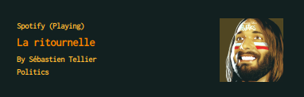

# Conky-Spotify

_Forked from Madh93_

Conky-Spotify shows the current Spotify track in Conky (title, artist, album, cover...)

## Installation

To install Conky-Spotify:

1. Clone or Dowload repo from GitHub
2. Move `conky-spotify` folder to your preferred location, e.g. `~/.conky/`
3. Reference it in your startup script;
	e.g `conky -d -b -c ~/.conky/conky-spotify/conkyrc_spotify 2> /dev/null & exit`

## Theme

Current flavour is Orange which is easily changeable via the configuration.

